# Catalog-App

Hello Developer

Catalog-App is an app made using Flutter. This app is can use Dark Mode functionality with android, it will change from light mode and dark mode depending on the current Android mode(light/dark). First, you need to log in to use the app, username and password should not be blank also password must be 6 or more than 6 characters. inside the app you can see all the products listed using cards, these are scrollable. to see other products you have to scroll down or up. on cards, you can see a small description of the product with a price of the product and also an Add to cart button, on clicking the Add to cart button you can add that product to the cart. on clicking on the product you can see more details about the product and also there is an Add to cart button with that you can add that certain product to the cart. you can add one more item to the cart. there is a Cart button on the main page of the app, upon clicking the button you can see the Cart page with the Total Price of the products you wish to buy, you can also remove items from the Cart page by clicking the minus button. this will result in removing the price removed product from the total price. There is a Buy button on the cart page upon clicking the button you can buy the products by paying the total price

Thank you!

Star⭐ the repo if you like what you see

Download
## Link
https://www.mediafire.com/file/mxb2l5msnj8q3x0/app-debug.apk/file

## ✨ Requirements
* Flutter
* Android
* IOS
* Web
* MacBook
* Windows
* A brain to think 🤓

## 🤓 Author
* Email : nihalpadwal@gmail.com

## Getting Started

This project uses Flutter 

Flutter is Google's UI toolkit for building beautiful, natively compiled applications for mobile, web, desktop, and embedded devices from a single codebase.

## 📸 ScreenShots

|------|

LoginPage

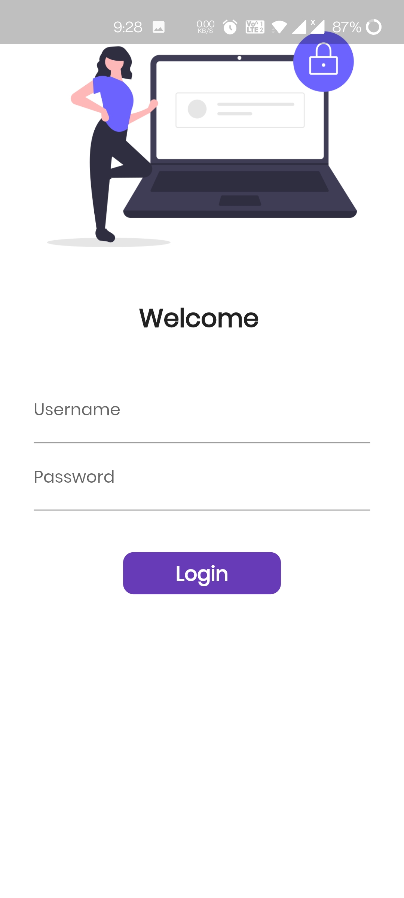
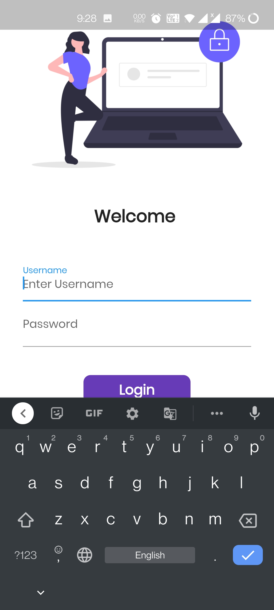
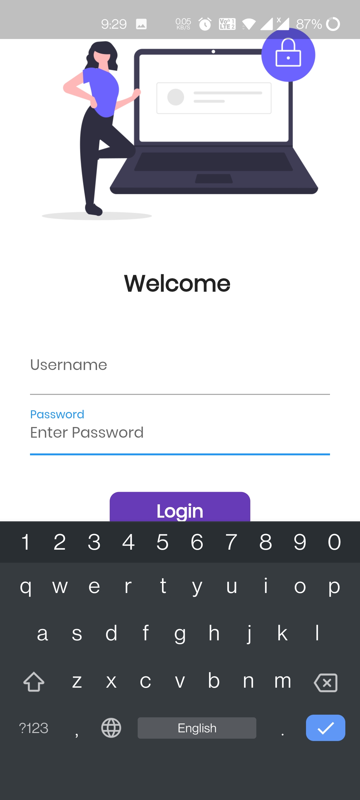

|------|

LoginPage(if Username and Password is Blank)

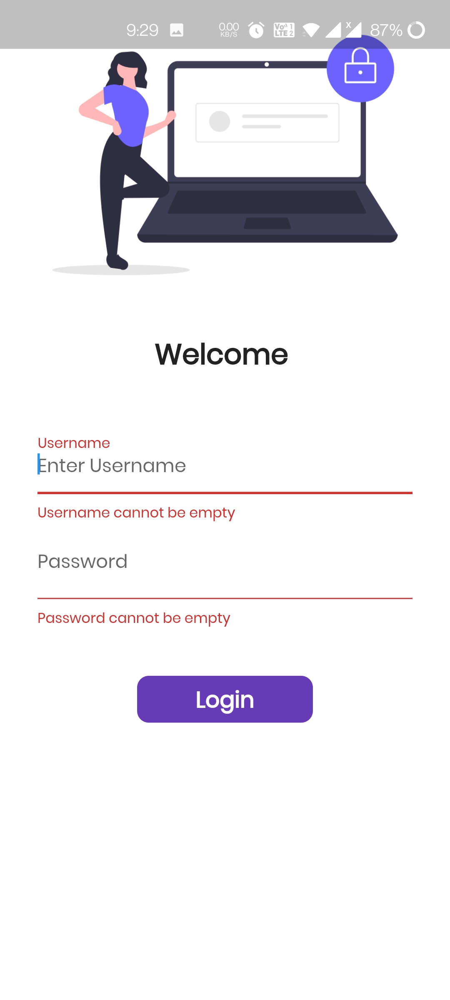

|------|

LoginPage(if Password is less thab 6 characters)

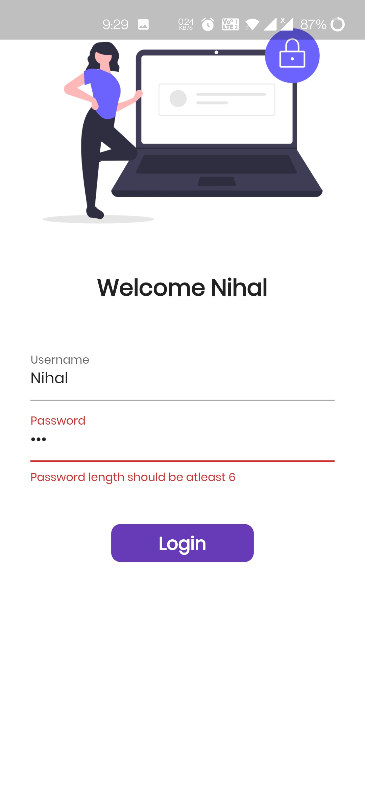

|------|

LoginPage(If everything is Correct)

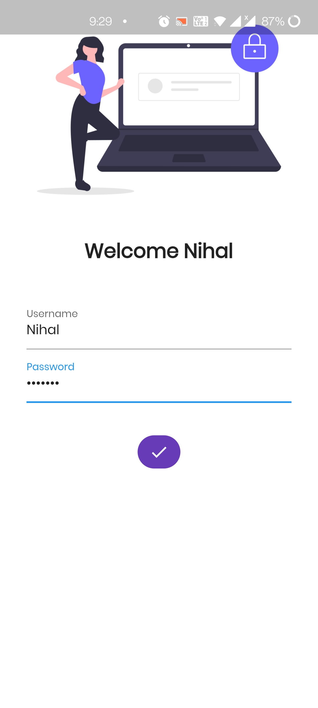

|------|

Catalog App

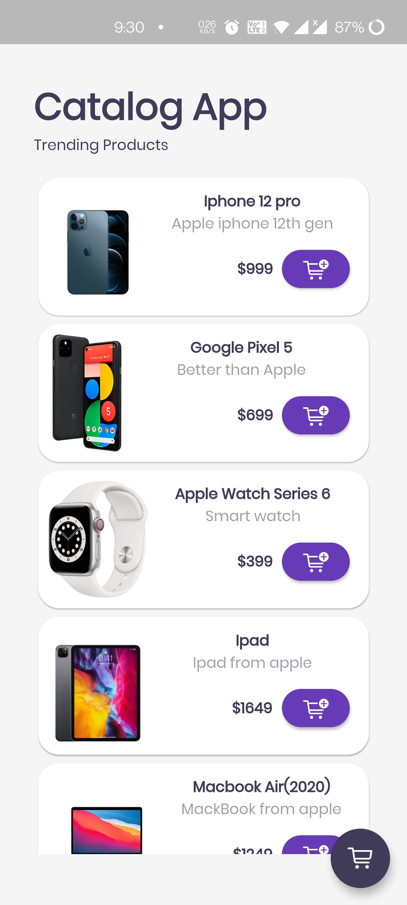

|------|

Catalog App(Dark Mode)

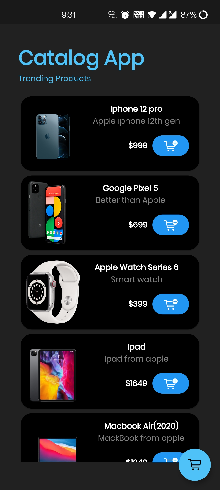

|------|

Catalog App(After Clicking on the Product)

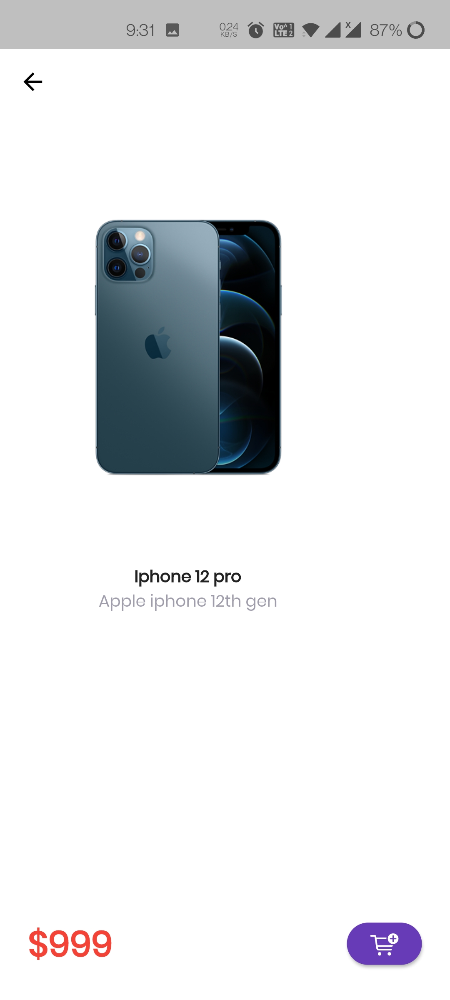

|------|

Cart Page

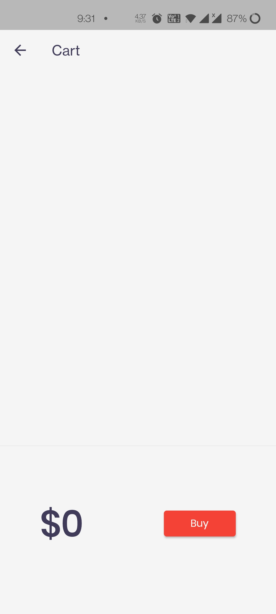

|------|

Cart Page(After adding products to the cart)

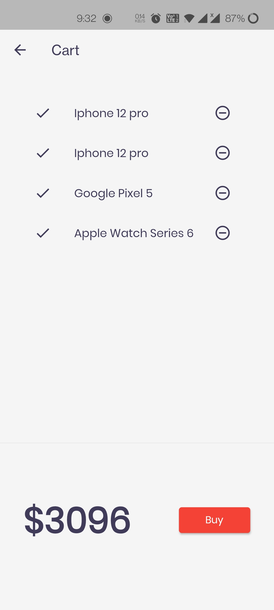

|------|

Cart Page(Dark Mode)

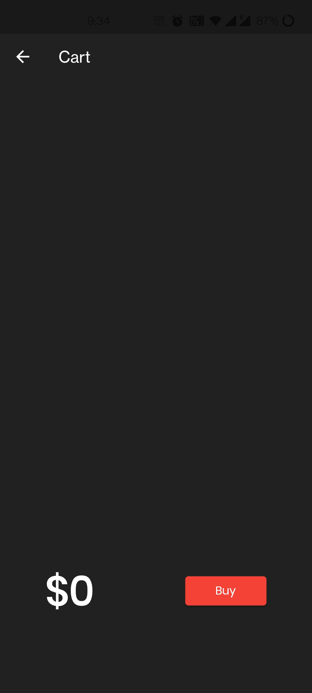
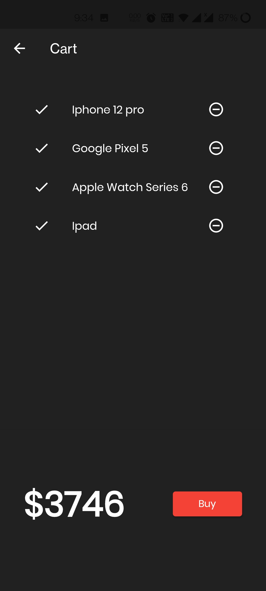

|------|

## LICENCE
 MIT License

Copyright (c) 2021 Nihal Padwal

Permission is hereby granted, free of charge, to any person obtaining a copy
of this software and associated documentation files (the "Software"), to deal
in the Software without restriction, including without limitation the rights
to use, copy, modify, merge, publish, distribute, sublicense, and/or sell
copies of the Software, and to permit persons to whom the Software is
furnished to do so, subject to the following conditions:

The above copyright notice and this permission notice shall be included in all
copies or substantial portions of the Software.

THE SOFTWARE IS PROVIDED "AS IS", WITHOUT WARRANTY OF ANY KIND, EXPRESS OR
IMPLIED, INCLUDING BUT NOT LIMITED TO THE WARRANTIES OF MERCHANTABILITY,
FITNESS FOR A PARTICULAR PURPOSE AND NONINFRINGEMENT. IN NO EVENT SHALL THE
AUTHORS OR COPYRIGHT HOLDERS BE LIABLE FOR ANY CLAIM, DAMAGES OR OTHER
LIABILITY, WHETHER IN AN ACTION OF CONTRACT, TORT OR OTHERWISE, ARISING FROM,
OUT OF OR IN CONNECTION WITH THE SOFTWARE OR THE USE OR OTHER DEALINGS IN THE
SOFTWARE.

